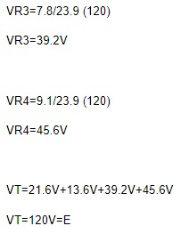
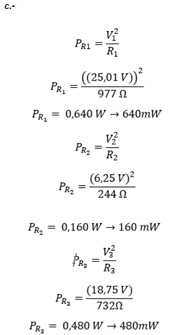
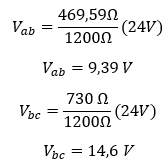

# Informe Tarea N°3
**Integrantes:**

Christian Bonifaz, Mateo Calderon, Josue Camacho, Luis Guevara

**NRC:** 5415

**Docente:** Ing. Darwin Alulema

**Tema:** Capitulo 5 (Circuitos en serie) y capitulo 6 (Circuitos en paralelo) de Análisis de Circuitos - Robbins, Miller

### 1. OBJETIVOS

- Emplear la teoria de Circuitos en serie aplicando  los conceptos aprendidos de análisis de circuitos

- Conocer y analizar las ideas y conceptos básicos sobre las resistencias tanto en serie como en paralelo, y como se calculan, así como también sobre Ley de Ohm, la ley de Kirchhoff, y los divisores de corriente y voltaje.

### 2. MARCO TEÓRICO

#### Capitulo 5 (Circuitos en serie)

#### Capitulo 6 (Circuitos en paralelo)

### 3. EXPLICACIÓN Y RESOLUCIÓN DE EJERCICIOS O PROBLEMAS

#### Capitulo 5 (Circuitos en serie)

**1. Los voltímetros de la figura 5-44 tienen autopolaridad. Determine la lectura de cada medidor, con la magnitud y el signo correctos.**

*Voltimetro a*

V=IxR

V= 3Ax10Ω

V= 30v

*Voltimetro b*

V=IxR

V=-6Ax15Ω

V= -90v

**2. Los voltímetros de la figura 5-45 tienen autopolaridad. Determine la lectura de cada medidor, con la magnitud y el signo correctos.**

*Voltimetro a*

V=IxR

V= -2Ax36Ω

V= - 72 v

*Voltimetro b*

V=IxR

V= 4Ax40Ω

V=160 v

**3. Todos los resistores de la figura 5-46 son de 15Ω . Determine para cada caso la magnitud y la polaridad del voltaje V.**

*Resistencia a*

V=IxR

V=3Ax15Ω

V=45v

*Resistencia b*

V=IxR

V= -4Ax15Ω

V=-60v

*Resistencia c*

V=IxR

V= 6Ax15Ω

V=90v

*Resistencia d*

V=IxR

V= -7Ax15Ω

V= -105 v

**4. El amperímetro de la figura 5-47 tiene autopolaridad. Determine sus lecturas,de la magnitud y el signo correctos.**

*Amperímetro a*

*Amperímetro b*

**5. Determine los voltajes desconocidos en las redes de la figura 5-48.**

*Voltaje a*

*Voltaje b*

**6. Determine los voltajes desconocidos en las redes de la figura 5-49.**

*Voltaje a*

*Voltaje b*

**7.Resuelva para hallar los voltajes desconocidos en el circuito de la figura 5-50.**

**8. Resuelva para hallar los voltajes desconocidos en el circuito de la figura 5-51.**

**9. Determine la resistencia total de las redes que se muestran en la figura 5-52.**

Rt = 3kΩ+2kΩ+5kΩ

Rt = 10kΩ

Rt = 360kΩ+580kΩ+2000kΩ

Rt = 2.94MΩ

Rt = 3900Ω+3900Ω+3900Ω+3900Ω+3900Ω+3900Ω

Rt = 23.4kΩ

**10. Determine las resistencias desconocidas en cada una de las redes que se muestran en la figura 5-53.**

*Resisencias figura a*

Rt = 10Ω+22Ω+47Ω+15Ω

Rt = 95Ω

*Resisencias figura b*

Rt = 12000Ω+12000Ω+12000Ω

Rt = 36kΩ

*Resisencias figura c*

Rt = 2R2+R2+6R2

36Ω=9R2

R2= 4Ω

R1=2R2

R1=2x(4Ω)

R1=8Ω

R3= 3R1

R3=6R2

R3=6x(4Ω)

R3= 24Ω

**11. Para cada uno de los circuitos de la figura 5-54, determine la resistencia total, RT, y la corriente I.**

Rt = R1+R2+R3+R4

Rt = 200Ω+400Ω+1000Ω+50Ω

Rt = 1650Ω

I = V/R

I = 10V/1650

I = 6.06mA

Rt = R1+R2+R3+R4

Rt = 1200Ω+3300Ω+5600Ω+820Ω+2200Ω+330Ω+4700Ω

Rt = 18150Ω

Rt = 18.15kΩ

I = V/R

I = 300/18150

I = 16.5mA

**12.  Para los circuitos de la figura 5-55 tienen resistencia total, RT, como se muestra. Para cada circuito encuentre lo siguiente:**

***a. La magnitud de la corriente en el circuito.***

I = E/R

I = 90/12

I = 7.5V 

***b. El total de potencia suministrada por la fuente de voltaje.***

Pt = ExI

Pt = 90x7.5

Pt = 675w

***c. La dirección de la corriente a través de cada resistor en el circuito.***

La resistencia se daría en sentido horario.

***d. El valor de la resistencia desconocida, R.***

Rt = R1+R2+R3+R4

R4 = Rt-R1-R2-R3

R4 = 12kΩ-1kΩ-4kΩ-3kΩ

R4 = 4kΩ

***e. La caída de voltaje en cada resistor.***

V1 = 7.5x1 = 7.5V

V2 = 7.5x4 = 30V

V3 = 7.5x3 = 22.5V

V4 = 7.5x4 = 30V

***f.La potencia disipada por cada resistor. Verifique que la suma de potencias disipadas por los resistores sea igual a la potencia suministrada por la fuente de voltaje.***

P1 = (7.5)^2 x (1kΩ) = 56.25w

P2 = (7.5)^2 x (4kΩ) = 225w

P3 = (7.5)^2 x (3kΩ) = 168.75w

P4 = (7.5)^2 x (4kΩ) = 225w

Pt = 56.25w+225+168.75+225w

Pt = 675w

**13. Para el circuito de la figura 5-56 encuentre las siguientes cantidades:**

 
 
***a. La corriente del circuito.***

***b. La resistencia total.***

***c. El valor de la resistencia desconocida, R.***

***d.La caída de voltaje en todos los resistores en el circuito.***

***e. La potencia disipada por todos los resistores.***

**14. El circuito de la figura 5-57 tiene una corriente de 2.5 mA. Encuentre las siguientes cantidades:**

***a. La resistencia total en el circuito.***

***b. El valor de la resistencia desconocida, R2.***

***c. La caída de voltaje en cada resistor en el circuito.***

***d. La potencia disipada por cada uno de los resistores.***

**15. Para el circuito de la figura 5-58, encuentre las siguientes cantidades:**

***a. La corriente, I.***

***b. La caída de voltaje en cada resistor en el circuito.***

***c. El voltaje en las terminales abiertas a y b.***

**16. Vea el circuito de la figura 5-59:**

***a. Utilice la ley de voltaje de Kirchhoff para encontrar las caídas de voltaje en R2 y R3.***

***b. Determine la magnitud de la corriente, I.***

I=0.02=20mA

***c. Encuentre la resistencia desconocida, R1.***

**17. Repita el problema 16 para el circuito de la figura 5-60.**

***a. Utilice la ley de voltaje de Kirchhoff para encontrar las caídas de voltaje en R2 y R3.***

∑V=0

16V-7.5V-(Ix4.7kΩ)-(Ix3.6kΩ)

8.5V-8.3kI=0

I= -8.5/-8.3

I=1.02409mA

VR2=IxR

VR2=1.02409mAx4.7kΩ

VR2=4.81325v

VR3=IxR

VR3=1.02409mAx3.6kΩ

VR3=3.68675v

***b. Determine la magnitud de la corriente, I.***

I=1.02409mA

***c. Encuentre la resistencia desconocida, R1.***

R1= VR1/I

R1= 7.5V/1.02409mA

R1= 7.32352kΩ

**18. Vea el circuito de la figura 5-61:**

***a. Encuentre RT.***

Rt = 1.8kΩ+3.3kΩ+10kΩ+8.2kΩ

Rt = 23.3

***b. Resuelva para hallar la corriente, I.***

I = 180/23.3

I = 7.73V

***c. Determine la caída de voltaje en cada resistor.***

V1 = 7.73x1.8 = 13.91

V2 = 7.73x3.3 = 25.50

V3 = 7.73x10 = 77.3

V4 = 7.73x8.2 = 63.386

***d. Verifique la Ley de voltaje de Kirchhoff alrededor del lazo cerrado.***

∑V=0

180V-13.91V-25.5V-77.3V-63.386V=0

0=0

***e. Encuentre la potencia disipada por cada resistor.***

P1 = (7.73)^2x1.8= 107.55mw

P2 = (7.73)^2x3.3= 197.18mw 

P3 = (7.73)^2x10= 597.52mw 

P4 = (7.73)^2x8.2= 489.97mw

***f. Muestre que la potencia suministrada por la fuente de voltaje es igual a la suma de las potencias disipadas por los resistores.***

Pt = 180x7.73= 1391.4mW

**19. Repita el problema 18 para el circuito de la figura 5-62.**

***a. Encuentre RT.***

Rt = 120Ω+39Ω+78Ω+220Ω

Rt = 457Ω

***b. Resuelva para hallar la corriente, I.***

I = 36/457

I = 0.078 A

I=78.77 mA 

***c. Verifique la Ley de voltaje de Kirchhoff alrededor del lazo cerrado.***

∑V=0

36V-9.45V-3.07V-6.14V-17.33V=0

0=0

***d. Determine la caída de voltaje en cada resistor.***

V1=(78.77)x120=9.45V

V2=(78.77)x39=3.07V

V3=(78.77)x78=6.14V

V4=(78.77)x220=17.33V

***e. Encuentre la potencia disipada por cada resistor.***

V1=(78.77/1000)^2x120=0.7445W

V2=(78.77/1000)^2x39=0.2419W

V3=(78.77/1000)^2x78=0.48397W

V4=(78.77/1000)^2x220=1.36503W

***f. Muestre que la potencia suministrada por la fuente de voltaje es igual a la suma de las potencias disipadas por los resistores.***

Pt= 36x78.77

Pt =2.836W

**20. Vea el circuito de la figura 5-63.**

***a. Calcule el voltaje en cada resistor.***

V3=IxR3

V3=3mAx8kΩ

V3=24V

V2=36V

∑V=0

72V-24V-36V-V1=0

V1=12V

***b. Determine los valores de los resistores R1 y R2.***

R1= V/I

R1= 12V/3mA

R1= 4kΩ

R2= V/I

R2=36V/ 3mA

R2=12kΩ

***c. Encuentre la potencia disipada por cada uno de los resistores.***

***21.Vuelva a dibujar los circuitos de la figura 5-64 para mostrar una sola fuente de voltaje para cada circuito. Encuentre la corriente para cada circuito.***

***22.Utilice la información dada para determinar la polaridad y la magnitud de la fuente de voltaje desconocida en cada uno de los circuitos de la figura 5-65.***

***23.Utilice la regla del divisor de voltaje para determinar el voltaje en cada resistor en los circuitos de la figura 5-66. Use sus resultados para verificar la ley de voltaje de Kirchhoff para cada circuito.***

***24.Repita el problema 23 para los circuitos de la figura 5-67.***

***25. Vea los circuitos de la figura 5-68:***

***26.Vea los circuitos de la figura 5-69:***

CIRCUITO 1

a. Use la regla del divisor de voltaje para encontrar los valores de los resistores
desconocidos.

b. Calcule el voltaje en R1 y R3.

c. Determine la potencia disipada por cada resistor.

CIRCUITO 2

a. Use la regla del divisor de voltaje para encontrar los valores de los resistores
desconocidos.

b. Calcule el voltaje en R1 y R3.

c. Determine la potencia disipada por cada resistor.

***27.Una serie de focos se conecta a una fuente de 120 V como se muestra en la figura 5-70.***

a.- Determine la corriente en el circuito.

b.- Utilice la regla del divisor de voltaje para encontrar el voltaje en cada foco.

c.- Calcule la potencia disipada por cada foco.

d.- Si un solo foco llegara a estar en circuito abierto, la serie entera dejaría de funcionar. Para prevenir que ello ocurra, cada foco tiene una pequeña cinta de metal que pone en corto al foco cuando el filamento falla. Repita los pasos (a) a (c), si dos focos de la serie se quemaran.

e.- Basado en sus cálculos del paso (d), ¿qué cree que pasaría con la esperanza de vida del resto de los focos, si los dos que fallan no fueran reemplazados?

La vida útil de los focos disminuye 

***28.Repita el problema 27 con una serie de 36 focos.***

a.-Determine la corriente en el circuito.

b.- Utilice la regla del divisor de voltaje para encontrar el voltaje en cada foco.

c.- Calcule la potencia disipada por cada foco.

d.- Si un solo foco llegara a estar en circuito abierto, la serie entera dejaría de funcionar. Para prevenir que ello ocurra, cada foco tiene una pequeña cinta de metal que pone en corto al foco cuando el filamento falla. Repita los pasos (a) a (c), si dos focos de la serie se quemaran.

e.- Basado en sus cálculos del paso (d), ¿qué cree que pasaría con la esperanza de vida del resto de los focos, si los dos que fallan no fueran reemplazados?

La vida útil de los focos disminuye 

***29.Resuelva para hallar los voltajes Vab y Vbc en los circuitos de la figura 5-68.***

CIRCUITO 1

CIRCUITO 2

***30.Repita el problema 29 para los circuitos de la figura 5-69.***

#### Capitulo 6 (Circuitos en paralelo)

1.	Indique cuáles de los elementos en la figura 6-44 están conectados en paralelo y cuáles en serie.

a)	A, B, D y E están en serie – C y F en paralelo

b)	B, C, y D están en paralelo 

c)	A, B, D y F están en paralelo – C y E están en serie

d)	B, C, A, D paralelo 

3.	Sin cambiar las posiciones de los componentes, muestre al menos una forma de conectar en paralelo todos los elementos de la figura 6-46

5.	Utilice la ley de corriente de Kirchhoff para determinar las magnitudes y direcciones de las corrientes que se indican en cada red que se muestra en la figura 6-48

a.  I1=5-2=3A                      b.I2=4-5=-1A

b. I1=6+1=7A                      b.I2=2A                         c.I3=-3-4=-7 A

c.I1=15-5-6=4mA         b.I2=5+7+6+2=20mA

7. Considere la red de la figura 6-50. 

a. Calcule las corrientes I1, I2, I3 e I4. 

b. Determine el valor de la resistencia R3

### 4. VIDEO

[Problemas Capítulos 5 y 6 - Informe Tarea N°3](https://youtu.be/H6SpjGA4e0Y "Problemas Capítulos 5 y 6 - Informe Tarea N°3")

### 5. CONCLUSIONES 

- Mediante el desarrollo de los ejercicios pudimos comprender más ampliamente los conceptos de los circutos serie y paralelo, así como también todos los elementos asociados a ellos como el cálculo de las resistencias equivalentes, como se componen y cómo se miden.

### 6. BIBLIOGRAFÍA

Robbins, A., & Miller, W. (2008). Análisis de circuitos. Estados Unidos: Cengage Learning.
